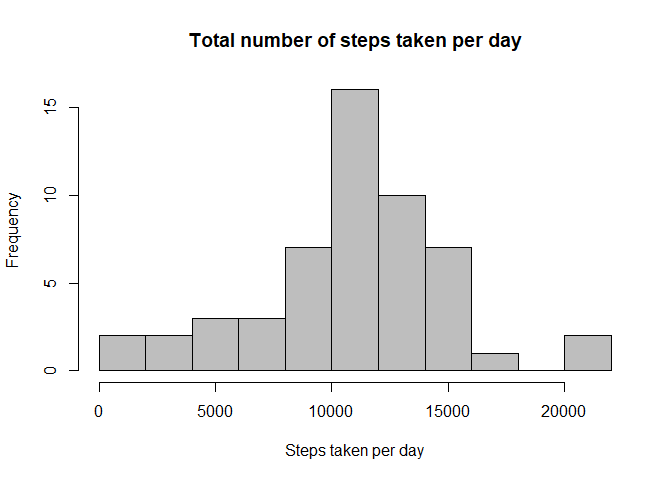
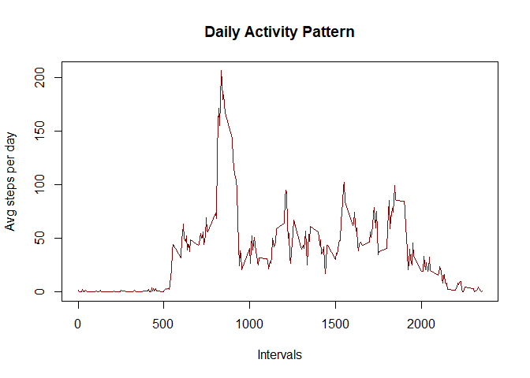
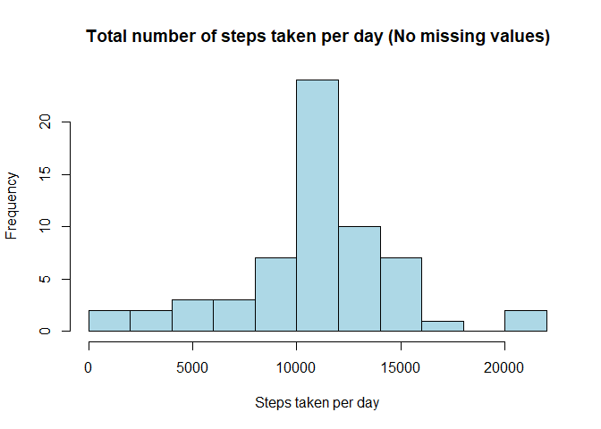
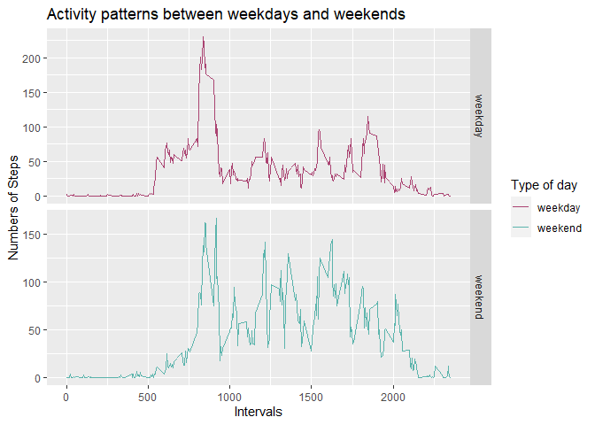

## Introduction

This assignment makes use of data from a personal activity monitoring device. This device collects data at 5 minute intervals through out the day. The data consists of two months of data from an anonymous individual collected during the months of October and November, 2012 and include the number of steps taken in 5 minute intervals each day.

This assignment will be described in multiple parts. First the questions to be answered are:

1. What is mean total number of steps taken per day?
2. What is the average daily activity pattern?
3. Imputing missing values
4. Are there differences in activity patterns between weekdays and weekends?

Ultimately, the next R markdown document it can be processed by knitr and be transformed into an HTML file.

## Global Option

The report includes the code that were used to generate the output for every question. The Global options to echo the code for every single chunk has been set to TRUE that way everyone will be able to read the code. 


```r
knitr::opts_chunk$set(echo = TRUE)
```

## Download the data
The next code download the files required to answer the questions. Additionally creates a folder called **Data** where the file is saved and the function **unzip()** extracts the data from the zip file.


```r
if(!file.exists("./Data")){
    dir.create("./Data")
    fileUrl <- "https://github.com/LGRIVASB/RepData_PeerAssessment1/raw/master/activity.zip"
    download.file(fileUrl, destfile = "./Data/activity.zip")
    
    #UNZIP DATA
    unzip("./Data/activity.zip", exdir = "./Data")
}
```

## Loading and preprocessing the data

The next steps were used for loading and preprocessing the data: 

### Reading file

The function **read.csv()** reads the file that contains the activity data. Using the separator *','*.


```r
activityData <- read.csv("./Data/activity.csv", sep = ",")
```

### Exploring Data

First look of the data to confirm it's dimensions and content


```r
str(activityData)
```

```
## 'data.frame':	17568 obs. of  3 variables:
##  $ steps   : int  NA NA NA NA NA NA NA NA NA NA ...
##  $ date    : Factor w/ 61 levels "2012-10-01","2012-10-02",..: 1 1 1 1 1 1 1 1 1 1 ...
##  $ interval: int  0 5 10 15 20 25 30 35 40 45 ...
```

```r
head(activityData)
```

```
##   steps       date interval
## 1    NA 2012-10-01        0
## 2    NA 2012-10-01        5
## 3    NA 2012-10-01       10
## 4    NA 2012-10-01       15
## 5    NA 2012-10-01       20
## 6    NA 2012-10-01       25
```

```r
tail(activityData)
```

```
##       steps       date interval
## 17563    NA 2012-11-30     2330
## 17564    NA 2012-11-30     2335
## 17565    NA 2012-11-30     2340
## 17566    NA 2012-11-30     2345
## 17567    NA 2012-11-30     2350
## 17568    NA 2012-11-30     2355
```

```r
summary(activityData$steps)
```

```
##    Min. 1st Qu.  Median    Mean 3rd Qu.    Max.    NA's 
##    0.00    0.00    0.00   37.38   12.00  806.00    2304
```

### Changing format type of the variable date

The variable **date** were change to date format. 


```r
activityData$date <- as.Date(activityData$date, "%Y-%m-%d")
class(activityData$date)
```

```
## [1] "Date"
```

## What is mean total number of steps taken per day?

To calculate the total number of steps taken per day, I used **dplyr** package to group the data by date and then filter the missing values. Finally, the variables were summarized with function *sum()*.


```r
library(dplyr)
stepsDay <- activityData %>% group_by(date) %>% 
            filter(!is.na(steps)) %>% 
            summarise(totalsteps = sum(steps))
```

Next I proceeded to represent the data with a histogram


```r
hist(stepsDay$totalsteps, breaks = seq(0, 22000, by=2000), 
            main = 'Total number of steps taken per day',
            xlab = 'Steps taken per day',
            col = 'gray')
```

<!-- -->

Last I calculated the mean and the median


```r
mean_steps_per_day <- mean(stepsDay$totalsteps)
median_steps_per_day <- median(stepsDay$totalsteps)
```
The answers for the question are:

1. The **mean** total number of steps take per day is 10766.19.  
2. The **median** total number of steps take per day is 10765.  

## What is the average daily activity pattern?

To calculate the average of steps taken per day, I used **dplyr** package to group the data by interval and then filter the missing values. Finally, the variables were summarized with function *mean()*.


```r
stepsInterval <- activityData %>% group_by(interval) %>% 
            filter(!is.na(steps)) %>% 
            summarise(totalsteps = mean(steps))
```

Next I proceeded to create the time series plot of the 5-minute interval(x-axis) and the average number of steps taken, averaged across all days (y-axis).


```r
plot(stepsInterval$interval, stepsInterval$totalsteps, type = 'l', 
            col = 'darkred', lwd = 1.8, xlab = 'Intervals', 
            ylab = 'Avg steps per day', 
            main = 'Daily Activity Pattern')
```

<!-- -->

Last I calculated the interval with the most number of steps taken.


```r
most_steps_on_average_interval <- stepsInterval[which.max(stepsInterval$totalsteps), ]$interval
max_steps <- max(stepsInterval$totalsteps)
```
The answer for the question is:

1. The **interval** with the most number of steps taken is 835 which has 206.1698 steps as total.

## Imputing missing values

The data has a certain number of days or intervals where there are missing values (coded as NA). The presence of missing days may introduce bias into some calculations or summaries of the data so we need a strategy for filling in all of the missing values in the dataset. 

I calculated the total number of missing values in the dataset with the next code:


```r
total_missing_values <- sum(is.na(activityData$steps))
```

The result is 2304. The process to replace the missing values is with a loop that change the NA value with the mean for that 5-minute interval. And finally i saved the new dataset called **activityDataNoNA**.


```r
activityDataNoNA <- activityData

for(i in 1:length(activityDataNoNA$steps)){
            if (is.na(activityDataNoNA$steps[i])){
                dateValue <- activityDataNoNA$date[i]
                activityDataNoNA$steps[i] <- filter(stepsInterval, interval == activityDataNoNA$interval[i])$totalsteps
            }   
}
```

There are no missing values in the new dataset. To confirm, we can use the next code:


```r
summary(activityDataNoNA$steps)
```

```
##    Min. 1st Qu.  Median    Mean 3rd Qu.    Max. 
##    0.00    0.00    0.00   37.38   27.00  806.00
```

As I did to answer the first question, the new data was grouped by date and the variables were summarized with function *sum()*.


```r
stepsDayNoNA <- activityDataNoNA %>% group_by(date) %>% 
            summarise(totalsteps = sum(steps))
```

The histogram for the new data is:


```r
hist(stepsDayNoNA$totalsteps, breaks = seq(0, 22000, by=2000), 
            main = 'Total number of steps taken per day (No missing values)',
            xlab = 'Steps taken per day',
            col = 'lightblue')
```

<!-- -->

Calculated the new **mean** and the new **median**.


```r
mean_steps_per_day_no_na <- mean(stepsDayNoNA$totalsteps)
median_steps_per_day_no_na <- median(stepsDayNoNA$totalsteps)
```

Last, I compared the results with the original dataset.

1. The **mean** changes from 10766.19 to 10766.19.  
2. The **median** changes from 10765 to 10766.19. 

There are **no** significant variation between the original dataset and new one.

## Are there differences in activity patterns between weekdays and weekends?

I created a new factor variable in the dataset that has no missing values. The variable has two levels -- "weekday" and "weekend" indicating whether a given date is a weekday or weekend day. The function **sapply** with the conditional function **if** were coded to do the new variable.


```r
activityDataNoNA$Week_Days <- sapply(activityDataNoNA$date, function(x){
            if (weekdays(x) == 'sábado' | weekdays(x) == 'domingo'){
                    y <- 'weekend'
            } else {
                    y <- 'weekday'
            }
            y
})
```

Then, I used **dplyr** package to group the data by **Week_Days**(New variable) and interval.
Finally, the variables were summarized with function *mean()*.


```r
activity_per_weekdays <- activityDataNoNA %>% 
            group_by(Week_Days, interval) %>%
            summarise(totalSteps = mean(steps))
```

Now I proceeded to make a panel plot(using **ggplo2** package) containing a time series plot of the 5-minute interval (x-axis) and the average number of steps taken, averaged across all weekday days or weekend days (y-axis). 


```r
library(ggplot2)
```

```
## Warning: package 'ggplot2' was built under R version 3.6.3
```

```r
g <- ggplot(activity_per_weekdays, aes(x = interval, y = totalSteps, color = Week_Days))

g + geom_line() +
            facet_grid(Week_Days ~ ., scales = 'free') + 
            labs(x = 'Intervals', y = 'Numbers of Steps', title = 'Activity patterns between weekdays and weekends', color = 'Type of day') + 
            scale_color_manual(values = c('#AA4371','#5ab4ac'))
```

<!-- -->

Now I subset the data to compare between both types of days with the **summary** function.


```r
weekdaySummary <- subset(activityDataNoNA, Week_Days == 'weekday')
summary(weekdaySummary$steps)
```

```
##    Min. 1st Qu.  Median    Mean 3rd Qu.    Max. 
##    0.00    0.00    0.00   35.61   24.00  806.00
```

```r
weekendSummary <- subset(activityDataNoNA, Week_Days == 'weekend')
summary(weekendSummary$steps)
```

```
##    Min. 1st Qu.  Median    Mean 3rd Qu.    Max. 
##    0.00    0.00    0.00   42.37   35.47  785.00
```

As we can observe the median of both subsets are equal but there is a difference between the means. The average of steps taken in saturday and sunday is higher than the other days of the week.

